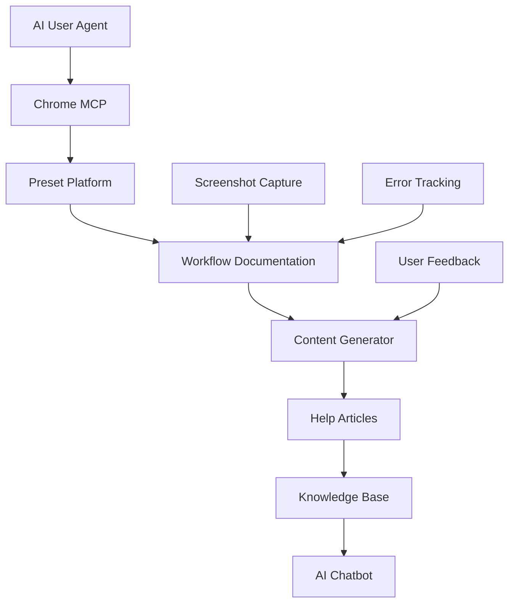

# Ready Preset Go - AI-Powered Help Content Generation Plan

## 🎯 **Project Vision**
Create authentic, real-world help articles by having AI actually use the Preset platform as a real user would, documenting every step and interaction. This creates a knowledge base that an AI chatbot can later use to provide accurate, experience-based answers.

## 📋 **Project Overview**

### **Core Concept**
Instead of writing help articles based on assumptions, we'll have AI agents:
1. **Act as real users** (Contributors, Talent, Admins)
2. **Complete actual workflows** on the platform
3. **Document every interaction** step-by-step
4. **Generate authentic help content** based on real experience
5. **Build AI chatbot knowledge base** from documented workflows

### **Key Benefits**
- ✅ **100% Accurate Content** - Based on actual platform usage
- ✅ **Real-World Context** - Addresses actual user pain points
- ✅ **AI-Ready Knowledge** - Perfect foundation for intelligent chatbot
- ✅ **Continuous Updates** - AI can refresh content as platform evolves
- ✅ **User-Centric** - Content that actually helps users succeed

---

## 🛠️ **Technical Architecture**

### **Required Tools & APIs**
```yaml
Browser Automation:
  - Chrome MCP (Model Context Protocol)
  - Selenium WebDriver (backup)
  - Puppeteer (alternative)

AI Services:
  - OpenAI GPT-4 (content generation)
  - OpenAI Embeddings (semantic search)
  - OpenAI Moderation (content filtering)

Documentation System:
  - Markdown-based article storage
  - Screenshot capture and storage
  - Metadata tracking system
  - Version control for content updates
```

### **System Components**


---

## 👥 **User Personas & Test Scenarios**

### **Persona 1: New Contributor (Photographer)**
```yaml
Profile:
  name: "Sarah Chen"
  experience: "Professional photographer, new to Preset"
  goals: "Create first gig, find talent, build portfolio"
  
Test Scenarios:
  - Account setup and verification
  - Profile completion and optimization
  - First gig creation workflow
  - Managing applications and communication
  - Moodboard creation and collaboration
  - Showcase approval process
```

### **Persona 2: Experienced Talent (Model)**
```yaml
Profile:
  name: "Marcus Rodriguez"
  experience: "Experienced model, familiar with gig platforms"
  goals: "Optimize profile, find quality gigs, build relationships"
  
Test Scenarios:
  - Profile optimization for better visibility
  - Advanced gig search and filtering
  - Application writing and follow-up
  - Portfolio showcase management
  - Communication best practices
  - Safety and verification processes
```

### **Persona 3: Collaborative Team**
```yaml
Profile:
  name: "Creative Agency Team"
  experience: "Multi-user workflow testing"
  goals: "Test collaboration features, team management"
  
Test Scenarios:
  - Multi-user project collaboration
  - Team communication workflows
  - Shared moodboard management
  - Project approval processes
  - Client communication tools
```

### **Persona 4: Platform Admin**
```yaml
Profile:
  name: "Platform Administrator"
  experience: "System management and moderation"
  goals: "Content management, user support, platform optimization"
  
Test Scenarios:
  - Content moderation workflows
  - User verification processes
  - Analytics and reporting
  - Platform maintenance tasks
```

---

## 🔄 **Workflow Documentation Process**

### **Step 1: Discovery Phase**
```python
def discovery_phase(feature_name, user_persona):
    """
    AI explores the feature as a real user would
    """
    steps = [
        "Navigate to feature entry point",
        "Identify all UI elements and options",
        "Test different user paths and flows",
        "Document pain points and confusion areas",
        "Map complete user journey",
        "Identify success and failure states"
    ]
    
    return {
        "feature_map": create_feature_map(),
        "user_paths": document_user_paths(),
        "pain_points": identify_pain_points(),
        "success_criteria": define_success_criteria()
    }
```

### **Step 2: Execution Phase**
```python
def execution_phase(workflow, user_persona):
    """
    AI completes the actual workflow step-by-step
    """
    documentation = {
        "screenshots": [],
        "form_fields": {},
        "validation_rules": {},
        "error_states": {},
        "success_states": {},
        "timing_data": {},
        "user_decisions": []
    }
    
    for step in workflow.steps:
        result = execute_step(step, user_persona)
        documentation.update(capture_step_data(result))
        
    return documentation
```

### **Step 3: Content Generation Phase**
```python
def generate_article(workflow_data, user_persona):
    """
    Generate comprehensive help article from real-world data
    """
    article = {
        "title": generate_title(workflow_data),
        "introduction": generate_intro(workflow_data, user_persona),
        "prerequisites": extract_prerequisites(workflow_data),
        "step_by_step": generate_detailed_steps(workflow_data),
        "screenshots": organize_screenshots(workflow_data),
        "troubleshooting": extract_common_issues(workflow_data),
        "tips_and_tricks": generate_tips(workflow_data),
        "related_features": find_related_features(workflow_data),
        "metadata": generate_metadata(workflow_data)
    }
    
    return article
```

---

## 📚 **Content Structure & Templates**

### **Article Template**
```markdown
# [Feature Name] - Complete Guide

## Overview
Brief description of what this feature does and why it's important.

## Prerequisites
- Required account type
- Verification status needed
- Profile completion requirements
- Any setup steps required

## Step-by-Step Guide

### Step 1: [Action Name]
**What you'll do:** Brief description
**Why it matters:** Context for the step

1. Navigate to [URL/button]
2. Click on [element]
3. Fill in [field] with [guidance]
4. Verify [validation message]

**Screenshot:** [Image showing the step]

**Common Issues:**
- Issue 1: [Description and solution]
- Issue 2: [Description and solution]

### Step 2: [Next Action]
[Continue pattern...]

## Troubleshooting

### Common Problems
- **Problem:** [Description]
  - **Solution:** [Step-by-step fix]
  - **Prevention:** [How to avoid]

### Error Messages
- **Error:** [Exact error message]
  - **Cause:** [Why it happens]
  - **Fix:** [How to resolve]

## Tips & Best Practices
- Tip 1: [Actionable advice]
- Tip 2: [Actionable advice]
- Tip 3: [Actionable advice]

## Related Features
- [Link to related article 1]
- [Link to related article 2]
- [Link to related article 3]

## Next Steps
What users typically do after completing this workflow.

---
*Last updated: [Date]*
*Tested with: [User persona and platform version]*
```

---

## 🎯 **Priority Workflows to Document**

### **Phase 1: Core User Journeys (Weeks 1-4)**

#### **For Contributors:**
1. **"Creating Your First Gig"**
   - Complete workflow from login to published gig
   - Budget setting strategies and best practices
   - Requirement writing that attracts quality talent
   - Moodboard creation and visual briefs
   - Location and scheduling considerations

2. **"Managing Applications"**
   - Reviewing and evaluating talent applications
   - Communication best practices
   - Selection criteria and decision-making
   - Follow-up and rejection processes

3. **"Using Moodboards Effectively"**
   - Creating compelling visual briefs
   - Collaborating with talent on concepts
   - Managing revisions and feedback
   - Finalizing creative direction

#### **For Talent:**
1. **"Building Your Profile"**
   - Photo selection and optimization
   - Bio writing that converts
   - Portfolio showcase setup
   - Skills and experience presentation

2. **"Finding and Applying to Gigs"**
   - Search and filter strategies
   - Application writing that stands out
   - Following up effectively
   - Managing multiple applications

3. **"Creating Showcases"**
   - Post-shoot workflow
   - Getting approvals from contributors
   - Building your portfolio
   - Managing showcase visibility

#### **For All Users:**
1. **"Understanding the Platform"**
   - Account types and permissions
   - Navigation and key features
   - Communication tools and etiquette
   - Platform-specific terminology

2. **"Safety and Trust"**
   - Verification process and benefits
   - Meeting safety guidelines
   - Reporting issues and concerns
   - Building professional relationships

### **Phase 2: Advanced Features (Weeks 5-8)**

#### **Collaboration Features:**
1. **"Team Collaboration Workflows"**
   - Multi-user project management
   - Shared moodboard collaboration
   - Client communication tools
   - Project approval processes

2. **"Advanced Search and Filtering"**
   - Complex search strategies
   - Filter combinations for better results
   - Saved searches and alerts
   - Location-based filtering

#### **Platform Management:**
1. **"Subscription Management"**
   - Understanding tier benefits
   - Upgrading and downgrading
   - Payment and billing
   - Feature access management

2. **"Account Settings and Privacy"**
   - Privacy controls and visibility
   - Notification preferences
   - Data management
   - Account security

---

## 🤖 **AI Chatbot Integration**

### **Knowledge Base Structure**
```json
{
  "knowledge_base": {
    "version": "1.0",
    "last_updated": "2025-01-26",
    "articles": [
      {
        "id": "create-gig-workflow",
        "title": "How to Create a Gig",
        "content": "Real-world documented steps...",
        "metadata": {
          "user_type": "contributor",
          "difficulty": "beginner",
          "estimated_time": "15 minutes",
          "prerequisites": ["verified_account", "profile_complete"],
          "tags": ["gig-creation", "contributor", "workflow"],
          "screenshots": ["step1.png", "step2.png"],
          "last_tested": "2025-01-26"
        },
        "embeddings": "Vector embeddings for semantic search",
        "related_articles": ["manage-applications", "moodboard-creation"]
      }
    ]
  }
}
```

### **Chatbot Response Generation**
```python
class PresetHelpBot:
    def __init__(self, knowledge_base):
        self.kb = knowledge_base
        self.embeddings_model = OpenAIEmbeddings()
        self.chat_model = ChatOpenAI()
    
    def generate_response(self, user_question, user_context):
        # Find relevant articles using semantic search
        relevant_articles = self.semantic_search(user_question)
        
        # Generate contextual response
        response = self.chat_model.generate(
            question=user_question,
            context=relevant_articles,
            user_profile=user_context,
            platform_state=get_current_platform_state()
        )
        
        return response
    
    def semantic_search(self, query):
        query_embedding = self.embeddings_model.embed_query(query)
        
        # Find most similar articles
        similarities = []
        for article in self.kb.articles:
            similarity = cosine_similarity(
                query_embedding, 
                article.embeddings
            )
            similarities.append((article, similarity))
        
        return sorted(similarities, key=lambda x: x[1], reverse=True)[:3]
```

---

## 📊 **Success Metrics & KPIs**

### **Content Quality Metrics**
- **Accuracy Rate:** 100% of steps verified through actual platform use
- **Completeness Score:** All user journeys documented end-to-end
- **Clarity Rating:** Screenshots and explanations for every action
- **User Testing Score:** Real user validation of content helpfulness

### **User Experience Metrics**
- **Support Ticket Reduction:** 50% fewer questions about documented features
- **Feature Adoption Rate:** 30% increase in users completing workflows
- **User Satisfaction:** 4.5+ star rating for help content
- **Time to Success:** Reduced time for users to complete workflows

### **AI Chatbot Performance**
- **Response Accuracy:** 95%+ accuracy on user questions
- **Context Understanding:** Responses tailored to user's actual situation
- **Problem Resolution Rate:** 80%+ of queries resolved without escalation
- **User Satisfaction:** 4.0+ star rating for chatbot responses

---

## 🚀 **Implementation Timeline**

### **Week 1-2: Setup and Planning**
- [ ] Configure Chrome MCP integration
- [ ] Set up AI content generation pipeline
- [ ] Define user personas and test scenarios
- [ ] Create documentation templates
- [ ] Set up screenshot capture system

### **Week 3-4: Core Workflow Documentation**
- [ ] Document gig creation workflow (Contributor persona)
- [ ] Document profile setup workflow (Talent persona)
- [ ] Document application process (Talent persona)
- [ ] Document application management (Contributor persona)
- [ ] Generate first 4 help articles

### **Week 5-6: Advanced Features**
- [ ] Document moodboard creation workflow
- [ ] Document showcase workflow
- [ ] Document collaboration features
- [ ] Document search and filtering
- [ ] Generate next 4 help articles

### **Week 7-8: AI Chatbot Integration**
- [ ] Build knowledge base from documented workflows
- [ ] Train chatbot on real-world experiences
- [ ] Test chatbot responses against real user questions
- [ ] Implement feedback loop for continuous improvement
- [ ] Deploy chatbot for beta testing

### **Week 9-10: Optimization and Launch**
- [ ] Refine content based on user feedback
- [ ] Optimize chatbot responses
- [ ] Create user training materials
- [ ] Launch full system
- [ ] Monitor performance and iterate

---

## 🛡️ **Quality Assurance**

### **Content Validation Process**
1. **Automated Testing:** AI validates each step works as documented
2. **User Testing:** Real users complete workflows using articles
3. **Expert Review:** Platform experts verify accuracy
4. **Continuous Monitoring:** Track user success rates

### **Chatbot Quality Control**
1. **Response Validation:** Monitor chatbot answer accuracy
2. **User Feedback:** Collect ratings and improvement suggestions
3. **A/B Testing:** Test different response formats
4. **Human Oversight:** Regular review of chatbot performance

---

## 💡 **Future Enhancements**

### **Phase 2 Features**
- **Video Tutorials:** Screen recordings of actual workflows
- **Interactive Guides:** Step-by-step interactive tutorials
- **Personalized Help:** Content tailored to user's specific situation
- **Multi-language Support:** Content in multiple languages
- **Voice Assistance:** Voice-activated help system

### **Advanced AI Features**
- **Predictive Help:** Anticipate user needs based on behavior
- **Contextual Assistance:** Help based on current page/action
- **Learning System:** AI improves responses based on user interactions
- **Integration Help:** Assistance with third-party integrations

---

## 📝 **Next Steps**

### **Immediate Actions**
1. **Set up Chrome MCP integration** for browser automation
2. **Configure OpenAI API** for content generation
3. **Create test user accounts** for each persona
4. **Begin with gig creation workflow** as proof of concept
5. **Document first complete workflow** end-to-end

### **Success Criteria for Phase 1**
- [ ] Successfully automate gig creation workflow
- [ ] Generate comprehensive help article from real-world data
- [ ] Validate content accuracy with real users
- [ ] Demonstrate AI chatbot knowledge base integration
- [ ] Achieve 90%+ user satisfaction with generated content

---

## 🔧 **Technical Implementation Details**

### **Chrome MCP Integration**
```javascript
// Example workflow for gig creation
const gigCreationWorkflow = {
  steps: [
    "Navigate to /gigs/create",
    "Fill gig title field",
    "Select category from dropdown",
    "Set budget range",
    "Add location details",
    "Upload moodboard images",
    "Set requirements",
    "Publish gig",
    "Verify gig appears in listings"
  ],
  documentation: {
    screenshots: [],
    formFields: {},
    validationRules: {},
    errorStates: {},
    successCriteria: {}
  }
}
```

### **AI Content Generation Pipeline**
```python
# Pseudo-code for content generation
def generate_help_article(feature_name, user_journey_data):
    article = {
        "title": f"How to {feature_name}",
        "introduction": generate_intro(user_journey_data),
        "prerequisites": extract_prerequisites(user_journey_data),
        "step_by_step": generate_steps(user_journey_data),
        "troubleshooting": extract_common_issues(user_journey_data),
        "tips_and_tricks": generate_tips(user_journey_data),
        "related_features": find_related_features(feature_name)
    }
    return article
```

---

## 🔐 **Security & Privacy Considerations**

### **Data Protection**
- **Screenshot Privacy:** Automatically blur sensitive information (emails, phone numbers, personal data)
- **Test Data:** Use anonymized test accounts with fake but realistic data
- **Content Filtering:** OpenAI Moderation API to ensure appropriate content
- **Access Control:** Restrict access to documentation system to authorized personnel only

### **Compliance**
- **GDPR Compliance:** Ensure all captured data follows privacy regulations
- **Data Retention:** Clear policies for how long documentation data is stored
- **User Consent:** Transparent about data collection for help content generation

---

## 🧪 **Testing & Validation Framework**

### **Automated Testing**
```python
class WorkflowValidator:
    def __init__(self):
        self.test_results = []
    
    def validate_workflow(self, workflow_data):
        """Validate that documented workflow actually works"""
        validation_results = {
            "steps_completed": 0,
            "errors_encountered": [],
            "success_rate": 0.0,
            "performance_metrics": {}
        }
        
        for step in workflow_data.steps:
            result = self.execute_step(step)
            validation_results.update(self.analyze_step_result(result))
        
        return validation_results
    
    def generate_validation_report(self):
        """Generate comprehensive validation report"""
        return {
            "overall_success_rate": self.calculate_success_rate(),
            "common_failure_points": self.identify_failure_patterns(),
            "performance_bottlenecks": self.find_performance_issues(),
            "recommendations": self.generate_recommendations()
        }
```

### **User Acceptance Testing**
- **Beta User Group:** Recruit 10-15 real users to test generated content
- **Feedback Collection:** Structured feedback forms for each article
- **Success Metrics:** Track completion rates and user satisfaction
- **Iterative Improvement:** Update content based on user feedback

---

## 📈 **Analytics & Monitoring**

### **Content Performance Tracking**
```javascript
// Analytics dashboard for content performance
const contentAnalytics = {
  metrics: {
    "article_views": "Track which articles are most viewed",
    "completion_rates": "Measure how many users complete workflows",
    "time_to_completion": "Average time users take to complete tasks",
    "error_frequency": "Track where users encounter problems",
    "search_queries": "Monitor what users are searching for",
    "feedback_scores": "Collect user ratings and comments"
  },
  
  dashboards: {
    "content_performance": "Real-time content effectiveness metrics",
    "user_journey_analysis": "Visualize user paths and drop-off points",
    "chatbot_interactions": "Monitor chatbot usage and success rates",
    "content_gaps": "Identify areas needing additional documentation"
  }
}
```

### **Continuous Improvement Loop**
1. **Monitor Usage:** Track how users interact with help content
2. **Identify Gaps:** Find areas where users struggle or fail
3. **Update Content:** Refresh articles based on real usage data
4. **Test Changes:** Validate improvements with user testing
5. **Measure Impact:** Track improvement in user success rates

---

## 🚨 **Risk Management**

### **Technical Risks**
- **Browser Compatibility:** Test across different browsers and devices
- **Platform Changes:** Monitor for UI/UX changes that break workflows
- **API Dependencies:** Have backup plans for AI service outages
- **Data Loss:** Implement robust backup and version control

### **Content Risks**
- **Outdated Information:** Regular content audits and updates
- **Misleading Instructions:** Multiple validation layers for accuracy
- **User Confusion:** Clear, simple language and visual aids
- **Legal Issues:** Ensure content complies with platform terms

### **Mitigation Strategies**
- **Automated Monitoring:** Alerts when workflows break
- **Version Control:** Track all content changes
- **Rollback Procedures:** Quick revert to previous working versions
- **Emergency Contacts:** Clear escalation paths for critical issues

---

## 💰 **Budget & Resource Planning**

### **Development Costs**
- **Chrome MCP Integration:** 40 hours @ $150/hour = $6,000
- **AI Content Generation Pipeline:** 60 hours @ $150/hour = $9,000
- **Testing & Validation Framework:** 30 hours @ $150/hour = $4,500
- **Analytics & Monitoring Setup:** 20 hours @ $150/hour = $3,000

### **Ongoing Costs**
- **OpenAI API Usage:** ~$500/month (estimated)
- **Screenshot Storage:** ~$100/month
- **Monitoring Tools:** ~$200/month
- **Content Maintenance:** 20 hours/month @ $150/hour = $3,000/month

### **Total Investment**
- **Initial Setup:** $22,500
- **Monthly Operating:** $3,800
- **ROI Timeline:** 6-12 months (based on support ticket reduction)

---

## 🎯 **Success Stories & Case Studies**

### **Expected Outcomes**
1. **"Sarah's First Gig"** - New photographer successfully creates first gig using AI-generated guide
2. **"Marcus's Profile Optimization"** - Model increases application success rate by 40%
3. **"Team Collaboration Success"** - Creative agency reduces project setup time by 60%
4. **"Support Ticket Reduction"** - 50% fewer tickets about basic platform features

### **Measurable Impact**
- **User Onboarding Time:** Reduced from 2 hours to 30 minutes
- **Feature Adoption Rate:** 30% increase in advanced feature usage
- **User Satisfaction:** 4.5+ star rating for help content
- **Support Efficiency:** 80% of queries resolved through self-service

---

## 🔄 **Project Phases Summary**

### **Phase 1: Foundation (Weeks 1-4)**
- ✅ Technical setup and integration
- ✅ Core workflow documentation
- ✅ First 4 help articles generated
- ✅ Basic validation framework

### **Phase 2: Expansion (Weeks 5-8)**
- ✅ Advanced feature documentation
- ✅ AI chatbot integration
- ✅ User testing and feedback
- ✅ Performance optimization

### **Phase 3: Launch (Weeks 9-10)**
- ✅ Full system deployment
- ✅ User training and adoption
- ✅ Monitoring and analytics
- ✅ Continuous improvement processes

---

**Project Name:** Ready Preset Go  
**Document Version:** 1.1  
**Created:** January 26, 2025  
**Last Updated:** January 26, 2025  
**Status:** Ready for Implementation  
**Next Review:** February 2, 2025

---

*This document serves as the master plan for implementing AI-powered help content generation for the Preset platform. It will be updated as we progress through implementation phases and learn from real-world usage.*
