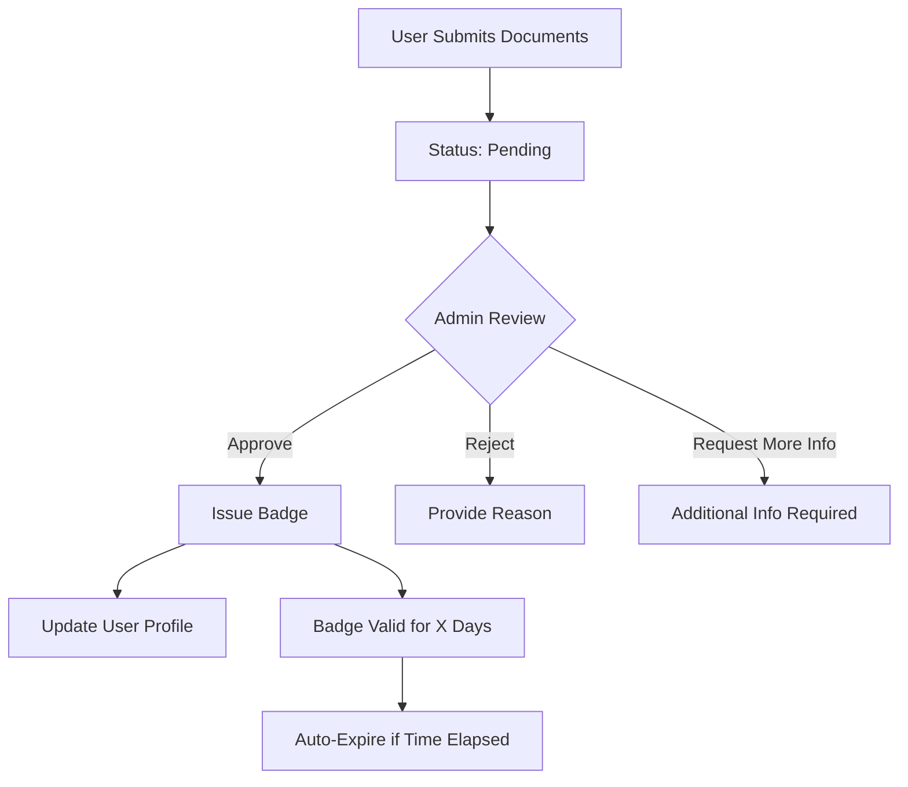

# 🔐 User Verification System Analysis - Preset.ie

## ✅ Current Verification Setup

### 1. **Age Verification (Basic)**
- **Location**: `/app/auth/signup/page.tsx`
- **Method**: Simple checkbox confirmation
- **Implementation**:
  ```typescript
  const [isOver18, setIsOver18] = useState(false)
  
  // User must check: "I confirm that I am 18 years or older"
  if (!isOver18) {
    setError('You must be 18 or older to use Preset')
    return
  }
  ```
- **Security Level**: ⚠️ **Low** - Self-attestation only

### 2. **Identity Verification System (Advanced)**
- **Database Tables**: 
  - `verification_requests` - Stores verification applications
  - `verification_badges` - Tracks verified status badges
  - `admin_verification_dashboard` - Admin view for managing requests

### 3. **Verification Types Available**
1. **Identity Verification** (`verified_identity`)
   - Government ID upload
   - Manual review by admin
   - Badge: `VERIFIED_ID`

2. **Professional Verification** (`verified_professional`)
   - Professional portfolio/credentials
   - Industry references
   - Badge: `VERIFIED_PRO`

3. **Business Verification** (`verified_business`)
   - Business registration documents
   - Tax documents
   - Badge: `VERIFIED_BUSINESS`

### 4. **Verification Workflow**



### 5. **Admin Dashboard Features**
- **Location**: `/app/components/admin/VerificationQueue.tsx`
- **Capabilities**:
  - View pending verification requests
  - Review uploaded documents
  - Approve/reject with notes
  - Set badge expiration periods
  - Track rejection history

### 6. **API Endpoints**
- `GET /api/admin/verification/requests` - List all requests
- `POST /api/admin/verification/[id]/approve` - Approve request
- `POST /api/admin/verification/[id]/reject` - Reject request
- `POST /api/admin/users/[id]/verify` - Direct user verification

## 🔍 Security Assessment

### ✅ **Strengths**
1. **Multi-tier verification** system with badges
2. **Manual review process** for identity documents
3. **Expiring badges** (default 365 days)
4. **Audit trail** with reviewer tracking
5. **RLS policies** protecting sensitive data
6. **Admin-only access** to verification management

### ⚠️ **Weaknesses & Gaps**

#### 1. **Age Verification**
- **Current**: Simple checkbox (legally minimal compliance)
- **Missing**:
  - No date of birth collection
  - No age calculation
  - No third-party age verification service
  - No periodic re-verification

#### 2. **Document Security**
- **Issue**: Document URLs stored as plain text array
- **Risk**: Potential exposure of sensitive documents
- **Recommendation**: Use encrypted storage buckets

#### 3. **Automated Verification**
- **Current**: All manual review
- **Missing**:
  - No OCR for document reading
  - No automatic ID validation
  - No facial recognition matching
  - No liveness detection

#### 4. **Email Verification**
- **Status**: ❓ Not clearly visible in current code
- **Needed**: Email confirmation before account activation

## 🛠️ Recommendations

### Immediate Improvements (High Priority)

1. **Enhanced Age Verification**
```typescript
// Add to signup form
const [dateOfBirth, setDateOfBirth] = useState('')

const calculateAge = (dob: string) => {
  const today = new Date()
  const birthDate = new Date(dob)
  let age = today.getFullYear() - birthDate.getFullYear()
  const monthDiff = today.getMonth() - birthDate.getMonth()
  
  if (monthDiff < 0 || (monthDiff === 0 && today.getDate() < birthDate.getDate())) {
    age--
  }
  return age
}

// Validate
if (calculateAge(dateOfBirth) < 18) {
  setError('You must be 18 or older to join Preset')
  return
}
```

2. **Email Verification**
```typescript
// After signup
await supabase.auth.signUp({
  email,
  password,
  options: {
    emailRedirectTo: `${window.location.origin}/auth/verify-email`
  }
})
```

3. **Secure Document Storage**
- Move documents to Supabase Storage with RLS
- Generate signed URLs with expiration
- Encrypt at rest

### Future Enhancements (Medium Priority)

1. **Third-Party Age Verification Services**
   - Integrate with services like Yoti, Jumio, or Onfido
   - Provides legally stronger age verification

2. **Automated ID Verification**
   - OCR for reading ID details
   - Face matching with selfie
   - Liveness detection to prevent spoofing

3. **Progressive Verification Levels**
   ```typescript
   enum VerificationLevel {
     BASIC = 'email_verified',
     STANDARD = 'age_verified',
     ENHANCED = 'id_verified',
     PROFESSIONAL = 'professional_verified'
   }
   ```

4. **Verification Requirements by Feature**
   - Basic profile: Email verification
   - Post gigs: Age + email verification
   - Handle payments: Full ID verification
   - Professional badge: Portfolio review

## 📊 Current Status Summary

| Verification Type | Status | Security Level | Notes |
|------------------|--------|---------------|-------|
| Age Verification | ✅ Basic | ⚠️ Low | Checkbox only |
| Email Verification | ❓ Unknown | - | Need to verify implementation |
| ID Verification | ✅ Available | ✅ High | Manual admin review |
| Professional Verification | ✅ Available | ✅ High | Manual review |
| Business Verification | ✅ Available | ✅ High | Manual review |
| Document Security | ⚠️ Basic | ⚠️ Medium | Plain text URLs |
| Automated Checks | ❌ None | - | All manual |

## 🚀 Implementation Priority

1. **Immediate** (This Week):
   - Add date of birth field to signup
   - Implement proper age calculation
   - Verify email verification is working
   - Add email confirmation requirement

2. **Short Term** (Next Sprint):
   - Secure document storage migration
   - Add verification status to user profiles UI
   - Implement verification prompts for certain actions

3. **Long Term** (Future):
   - Third-party verification service integration
   - Automated document verification
   - Progressive verification system
   - Verification analytics dashboard

## 💡 Legal Considerations

- **GDPR Compliance**: Need clear consent for document storage
- **Data Retention**: Auto-delete rejected verification documents after X days
- **Age Verification Laws**: Current checkbox meets minimum requirements but may not be sufficient for all jurisdictions
- **Right to be Forgotten**: Ensure verification data can be fully deleted

---

**Overall Assessment**: The verification system has a solid foundation with good admin controls and multiple verification types. However, age verification is minimal and should be enhanced for better legal compliance and user safety.