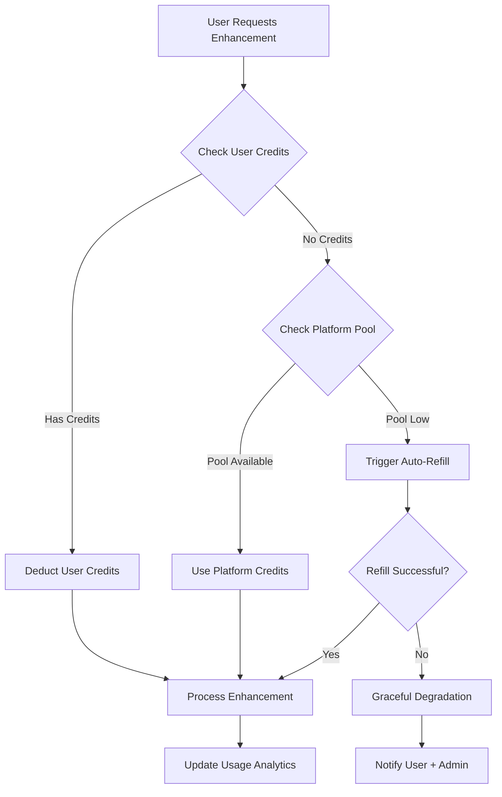

# Complete Credit Management & Payment System

## 🎯 Credit Management Strategy

### Hybrid Credit Model (Recommended)
**Platform Pre-purchases Credits + Overflow Protection**



### Credit Allocation Strategy
- **Platform Pool**: 80% of monthly revenue allocated to credits
- **User Allowances**: Based on subscription tier
- **Overflow Protection**: Emergency credit reserves
- **Auto-refill**: Triggered at 20% remaining

---

## 🗄️ Database Schema for Credit Management

### Enhanced Database Schema

```sql
-- Credit pools and tracking
CREATE TABLE credit_pools (
  id UUID PRIMARY KEY DEFAULT gen_random_uuid(),
  provider VARCHAR(50) NOT NULL, -- 'nanobanan', 'fal_ai', etc.
  total_purchased DECIMAL(12,4) DEFAULT 0,
  total_consumed DECIMAL(12,4) DEFAULT 0,
  available_balance DECIMAL(12,4) DEFAULT 0,
  cost_per_credit DECIMAL(8,4) NOT NULL,
  last_refill_at TIMESTAMP WITH TIME ZONE,
  auto_refill_threshold DECIMAL(12,4) DEFAULT 100, -- Refill when below this
  auto_refill_amount DECIMAL(12,4) DEFAULT 500,
  status VARCHAR(20) DEFAULT 'active', -- active, suspended, depleted
  created_at TIMESTAMP WITH TIME ZONE DEFAULT NOW(),
  updated_at TIMESTAMP WITH TIME ZONE DEFAULT NOW()
);

-- User credit allocations and usage
CREATE TABLE user_credits (
  id UUID PRIMARY KEY DEFAULT gen_random_uuid(),
  user_id UUID REFERENCES auth.users(id) ON DELETE CASCADE,
  subscription_tier VARCHAR(20) NOT NULL,
  monthly_allowance INTEGER DEFAULT 0, -- Credits per month based on tier
  current_balance INTEGER DEFAULT 0,
  consumed_this_month INTEGER DEFAULT 0,
  last_reset_at TIMESTAMP WITH TIME ZONE DEFAULT DATE_TRUNC('month', NOW()),
  lifetime_consumed INTEGER DEFAULT 0,
  created_at TIMESTAMP WITH TIME ZONE DEFAULT NOW(),
  updated_at TIMESTAMP WITH TIME ZONE DEFAULT NOW(),
  UNIQUE(user_id)
);

-- Detailed usage tracking
CREATE TABLE credit_transactions (
  id UUID PRIMARY KEY DEFAULT gen_random_uuid(),
  user_id UUID REFERENCES auth.users(id),
  moodboard_id UUID REFERENCES moodboards(id),
  transaction_type VARCHAR(20) NOT NULL, -- 'deduction', 'refund', 'allocation'
  credits_used INTEGER NOT NULL,
  cost_usd DECIMAL(8,4),
  provider VARCHAR(50),
  api_request_id VARCHAR(100), -- Track specific API calls
  enhancement_type VARCHAR(50),
  status VARCHAR(20) DEFAULT 'completed', -- completed, failed, pending
  error_message TEXT,
  created_at TIMESTAMP WITH TIME ZONE DEFAULT NOW()
);

-- Platform-wide usage analytics
CREATE TABLE daily_usage_summary (
  id UUID PRIMARY KEY DEFAULT gen_random_uuid(),
  date DATE NOT NULL,
  total_requests INTEGER DEFAULT 0,
  successful_requests INTEGER DEFAULT 0,
  failed_requests INTEGER DEFAULT 0,
  total_credits_consumed INTEGER DEFAULT 0,
  total_cost_usd DECIMAL(10,4) DEFAULT 0,
  free_tier_usage INTEGER DEFAULT 0,
  plus_tier_usage INTEGER DEFAULT 0,
  pro_tier_usage INTEGER DEFAULT 0,
  created_at TIMESTAMP WITH TIME ZONE DEFAULT NOW(),
  UNIQUE(date)
);

-- Alert configurations
CREATE TABLE credit_alerts (
  id UUID PRIMARY KEY DEFAULT gen_random_uuid(),
  alert_type VARCHAR(50) NOT NULL, -- 'low_credits', 'high_usage', 'api_failure'
  threshold_value DECIMAL(10,4),
  notification_channels TEXT[], -- ['email', 'slack', 'sms']
  is_active BOOLEAN DEFAULT true,
  last_triggered_at TIMESTAMP WITH TIME ZONE,
  created_at TIMESTAMP WITH TIME ZONE DEFAULT NOW()
);

-- API provider configurations
CREATE TABLE api_providers (
  id UUID PRIMARY KEY DEFAULT gen_random_uuid(),
  name VARCHAR(50) NOT NULL UNIQUE,
  base_url TEXT NOT NULL,
  api_key_encrypted TEXT NOT NULL, -- Encrypted API key
  cost_per_request DECIMAL(8,4) NOT NULL,
  rate_limit_per_minute INTEGER DEFAULT 60,
  priority INTEGER DEFAULT 1, -- 1 = primary, 2 = fallback, etc.
  is_active BOOLEAN DEFAULT true,
  health_check_url TEXT,
  last_health_check TIMESTAMP WITH TIME ZONE,
  success_rate_24h DECIMAL(5,2) DEFAULT 100.00,
  created_at TIMESTAMP WITH TIME ZONE DEFAULT NOW()
);

-- Indexes
CREATE INDEX idx_user_credits_user_id ON user_credits(user_id);
CREATE INDEX idx_credit_transactions_user_id ON credit_transactions(user_id);
CREATE INDEX idx_credit_transactions_created_at ON credit_transactions(created_at);
CREATE INDEX idx_daily_usage_date ON daily_usage_summary(date);

-- RLS Policies
ALTER TABLE user_credits ENABLE ROW LEVEL SECURITY;
ALTER TABLE credit_transactions ENABLE ROW LEVEL SECURITY;

CREATE POLICY "Users can view their own credits" ON user_credits
  FOR SELECT USING (auth.uid() = user_id);

CREATE POLICY "Users can view their own transactions" ON credit_transactions
  FOR SELECT USING (auth.uid() = user_id);
```

---

## 🏗️ Credit Management Service

### Core Credit Management Class

```typescript
// packages/application/credits/CreditManager.ts
export class CreditManager {
  constructor(
    private supabase: SupabaseClient,
    private redis: RedisClient,
    private alertService: AlertService,
    private providers: Map<string, AIProvider>
  ) {}

  async allocateMonthlyCredits(): Promise<void> {
    const creditAllocations = {
      free: 0,
      plus: 10,   // 10 AI enhancements per month
      pro: 25     // 25 AI enhancements per month
    };

    // Reset monthly allowances for all users
    const { data: users } = await this.supabase
      .from('users_profile')
      .select('user_id, subscription_tier');

    for (const user of users || []) {
      const allowance = creditAllocations[user.subscription_tier as keyof typeof creditAllocations] || 0;
      
      await this.supabase
        .from('user_credits')
        .upsert({
          user_id: user.user_id,
          subscription_tier: user.subscription_tier,
          monthly_allowance: allowance,
          current_balance: allowance,
          consumed_this_month: 0,
          last_reset_at: new Date().toISOString()
        });
    }
  }

  async checkAndConsumeCredits(
    userId: string, 
    creditsNeeded: number,
    enhancementType: string
  ): Promise<CreditConsumptionResult> {
    // 1. Check user's personal credits first
    const userCredits = await this.getUserCredits(userId);
    
    if (userCredits.current_balance >= creditsNeeded) {
      return await this.consumeUserCredits(userId, creditsNeeded, enhancementType);
    }

    // 2. Check if user's tier allows platform credit usage
    if (userCredits.subscription_tier === 'free') {
      throw new Error('Insufficient credits. Upgrade to Plus or Pro for AI enhancements.');
    }

    // 3. Use platform pool credits
    return await this.consumePlatformCredits(userId, creditsNeeded, enhancementType);
  }

  private async consumeUserCredits(
    userId: string, 
    creditsNeeded: number,
    enhancementType: string
  ): Promise<CreditConsumptionResult> {
    const { data, error } = await this.supabase.rpc('consume_user_credits', {
      p_user_id: userId,
      p_credits: creditsNeeded,
      p_enhancement_type: enhancementType
    });

    if (error) throw new Error(`Credit consumption failed: ${error.message}`);

    return {
      source: 'user_credits',
      creditsConsumed: creditsNeeded,
      remainingBalance: data.remaining_balance,
      costUsd: 0 // User credits are pre-paid
    };
  }

  private async consumePlatformCredits(
    userId: string,
    creditsNeeded: number,
    enhancementType: string
  ): Promise<CreditConsumptionResult> {
    // Check platform pool
    const { data: pool } = await this.supabase
      .from('credit_pools')
      .select('*')
      .eq('provider', 'nanobanan')
      .eq('status', 'active')
      .single();

    if (!pool || pool.available_balance < creditsNeeded) {
      // Try to auto-refill
      const refillSuccess = await this.autoRefillCredits('nanobanan');
      if (!refillSuccess) {
        throw new Error('Platform credits depleted. Please contact support.');
      }
    }

    // Consume from platform pool
    const costUsd = creditsNeeded * pool.cost_per_credit;
    
    await this.supabase.rpc('consume_platform_credits', {
      p_provider: 'nanobanan',
      p_credits: creditsNeeded,
      p_cost: costUsd
    });

    // Log transaction
    await this.logCreditTransaction({
      userId,
      transactionType: 'platform_deduction',
      creditsUsed: creditsNeeded,
      costUsd,
      provider: 'nanobanan',
      enhancementType
    });

    return {
      source: 'platform_pool',
      creditsConsumed: creditsNeeded,
      remainingBalance: pool.available_balance - creditsNeeded,
      costUsd
    };
  }

  async autoRefillCredits(provider: string): Promise<boolean> {
    try {
      const { data: pool } = await this.supabase
        .from('credit_pools')
        .select('*')
        .eq('provider', provider)
        .single();

      if (!pool) return false;

      // Purchase more credits from provider
      const purchaseResult = await this.purchaseCreditsFromProvider(
        provider,
        pool.auto_refill_amount
      );

      if (purchaseResult.success) {
        // Update pool
        await this.supabase
          .from('credit_pools')
          .update({
            total_purchased: pool.total_purchased + pool.auto_refill_amount,
            available_balance: pool.available_balance + pool.auto_refill_amount,
            last_refill_at: new Date().toISOString()
          })
          .eq('id', pool.id);

        await this.alertService.notify({
          type: 'credit_refill_success',
          message: `Successfully refilled ${pool.auto_refill_amount} credits for ${provider}`,
          level: 'info'
        });

        return true;
      }

      return false;
    } catch (error) {
      await this.alertService.notify({
        type: 'credit_refill_failed',
        message: `Failed to refill credits for ${provider}: ${error.message}`,
        level: 'error'
      });

      return false;
    }
  }

  private async purchaseCreditsFromProvider(
    provider: string,
    amount: number
  ): Promise<{ success: boolean; transactionId?: string }> {
    // This would integrate with provider's billing API
    // For now, simulate with manual admin approval
    
    const { data: config } = await this.supabase
      .from('api_providers')
      .select('*')
      .eq('name', provider)
      .single();

    if (!config) throw new Error(`Provider ${provider} not configured`);

    // In production, this would call the provider's billing API
    // For manual handling, create a purchase request
    await this.supabase
      .from('credit_purchase_requests')
      .insert({
        provider,
        amount_requested: amount,
        estimated_cost: amount * config.cost_per_request,
        status: 'pending_manual_approval',
        requested_at: new Date().toISOString()
      });

    // For auto-approval (if you have billing API integration)
    return { success: true, transactionId: `auto_${Date.now()}` };
  }

  async getUserCredits(userId: string): Promise<UserCredits> {
    const { data, error } = await this.supabase
      .from('user_credits')
      .select('*')
      .eq('user_id', userId)
      .single();

    if (error && error.code === 'PGRST116') {
      // User credits don't exist, create them
      return await this.initializeUserCredits(userId);
    }

    if (error) throw new Error(`Failed to fetch user credits: ${error.message}`);

    // Check if monthly reset is needed
    const lastReset = new Date(data.last_reset_at);
    const now = new Date();
    const monthsSinceReset = (now.getFullYear() - lastReset.getFullYear()) * 12 + 
                            now.getMonth() - lastReset.getMonth();

    if (monthsSinceReset >= 1) {
      return await this.resetMonthlyCredits(userId);
    }

    return data;
  }

  private async logCreditTransaction(transaction: Partial<CreditTransaction>): Promise<void> {
    await this.supabase
      .from('credit_transactions')
      .insert({
        user_id: transaction.userId,
        moodboard_id: transaction.moodboardId,
        transaction_type: transaction.transactionType,
        credits_used: transaction.creditsUsed,
        cost_usd: transaction.costUsd,
        provider: transaction.provider,
        enhancement_type: transaction.enhancementType,
        status: 'completed'
      });
  }
}

// Types
interface CreditConsumptionResult {
  source: 'user_credits' | 'platform_pool';
  creditsConsumed: number;
  remainingBalance: number;
  costUsd: number;
}

interface UserCredits {
  user_id: string;
  subscription_tier: string;
  monthly_allowance: number;
  current_balance: number;
  consumed_this_month: number;
  last_reset_at: string;
}

interface CreditTransaction {
  userId: string;
  moodboardId?: string;
  transactionType: string;
  creditsUsed: number;
  costUsd: number;
  provider: string;
  enhancementType: string;
}
```

---

## 🚨 Alert & Monitoring System

### Real-time Alert Service

```typescript
// packages/adapters/alerts/AlertService.ts
export class AlertService {
  constructor(
    private supabase: SupabaseClient,
    private slackWebhook: string,
    private emailService: EmailService
  ) {}

  async notify(alert: Alert): Promise<void> {
    // Log alert
    await this.supabase
      .from('system_alerts')
      .insert({
        type: alert.type,
        level: alert.level,
        message: alert.message,
        metadata: alert.metadata,
        created_at: new Date().toISOString()
      });

    // Send notifications based on level
    if (alert.level === 'error' || alert.level === 'critical') {
      await Promise.all([
        this.sendSlackAlert(alert),
        this.sendEmailAlert(alert)
      ]);
    } else if (alert.level === 'warning') {
      await this.sendSlackAlert(alert);
    }
  }

  private async sendSlackAlert(alert: Alert): Promise<void> {
    const color = {
      info: '#36a64f',
      warning: '#ff9500', 
      error: '#ff0000',
      critical: '#8B0000'
    }[alert.level];

    const payload = {
      attachments: [{
        color,
        title: `🚨 ${alert.type.toUpperCase()}`,
        text: alert.message,
        fields: [
          { title: 'Level', value: alert.level, short: true },
          { title: 'Time', value: new Date().toISOString(), short: true }
        ]
      }]
    };

    await fetch(this.slackWebhook, {
      method: 'POST',
      headers: { 'Content-Type': 'application/json' },
      body: JSON.stringify(payload)
    });
  }

  async checkCreditThresholds(): Promise<void> {
    // Check platform credit pools
    const { data: pools } = await this.supabase
      .from('credit_pools')
      .select('*')
      .eq('status', 'active');

    for (const pool of pools || []) {
      const usagePercentage = (pool.total_consumed / pool.total_purchased) * 100;
      
      if (pool.available_balance <= pool.auto_refill_threshold) {
        await this.notify({
          type: 'low_platform_credits',
          level: 'warning',
          message: `Platform credits low for ${pool.provider}: ${pool.available_balance} remaining`,
          metadata: { provider: pool.provider, remaining: pool.available_balance }
        });
      }

      if (usagePercentage > 90) {
        await this.notify({
          type: 'high_credit_usage',
          level: 'warning',
          message: `High usage detected: ${usagePercentage.toFixed(1)}% of credits consumed`,
          metadata: { provider: pool.provider, usagePercentage }
        });
      }
    }

    // Check for users hitting limits
    const { data: limitedUsers } = await this.supabase
      .from('user_credits')
      .select('user_id, subscription_tier, current_balance')
      .eq('current_balance', 0);

    if (limitedUsers && limitedUsers.length > 10) {
      await this.notify({
        type: 'many_users_credit_limited',
        level: 'info',
        message: `${limitedUsers.length} users have exhausted their monthly credits`,
        metadata: { count: limitedUsers.length }
      });
    }
  }
}

interface Alert {
  type: string;
  level: 'info' | 'warning' | 'error' | 'critical';
  message: string;
  metadata?: any;
}
```

---

## 🔄 Graceful Degradation Strategies

### Multi-Provider Fallback System

```typescript
// packages/adapters/external/AIProviderManager.ts
export class AIProviderManager {
  private providers: AIProvider[] = [];

  constructor(private creditManager: CreditManager) {
    this.initializeProviders();
  }

  private initializeProviders(): void {
    this.providers = [
      new NanoBananaProvider({ priority: 1, costPerRequest: 0.025 }),
      new FalAIProvider({ priority: 2, costPerRequest: 0.039 }),
      new KieAIProvider({ priority: 3, costPerRequest: 0.023 }),
      new GoogleDirectProvider({ priority: 4, costPerRequest: 0.039 })
    ].sort((a, b) => a.priority - b.priority);
  }

  async enhanceImageWithFallback(
    request: AIEnhancementRequest,
    userId: string
  ): Promise<AIEnhancementResult> {
    const errors: Error[] = [];

    for (const provider of this.providers) {
      try {
        // Check if provider is healthy
        if (!await provider.healthCheck()) {
          continue;
        }

        // Check and consume credits
        const creditResult = await this.creditManager.checkAndConsumeCredits(
          userId,
          1, // 1 credit per enhancement
          request.enhancementType
        );

        // Attempt enhancement
        const result = await provider.enhanceImage(request);

        // Log successful transaction
        await this.creditManager.logTransaction({
          userId,
          provider: provider.name,
          creditsUsed: 1,
          costUsd: creditResult.costUsd,
          status: 'completed',
          apiRequestId: result.id
        });

        return {
          ...result,
          provider: provider.name,
          costUsd: creditResult.costUsd
        };

      } catch (error) {
        errors.push(new Error(`${provider.name}: ${error.message}`));
        
        // Log failed attempt
        await this.creditManager.logTransaction({
          userId,
          provider: provider.name,
          creditsUsed: 0,
          costUsd: 0,
          status: 'failed',
          errorMessage: error.message
        });

        continue;
      }
    }

    // All providers failed
    throw new Error(`All AI providers failed: ${errors.map(e => e.message).join(', ')}`);
  }

  async getProviderStatus(): Promise<ProviderStatus[]> {
    return Promise.all(
      this.providers.map(async (provider) => ({
        name: provider.name,
        priority: provider.priority,
        isHealthy: await provider.healthCheck(),
        costPerRequest: provider.costPerRequest,
        successRate24h: await provider.getSuccessRate(),
        lastError: await provider.getLastError()
      }))
    );
  }
}

// Graceful degradation middleware
export class GracefulDegradationMiddleware {
  async handleRequest(
    request: AIEnhancementRequest,
    userId: string
  ): Promise<AIEnhancementResult | DegradedResponse> {
    try {
      // Try AI enhancement
      return await this.aiProviderManager.enhanceImageWithFallback(request, userId);
      
    } catch (error) {
      // Graceful fallback options
      return await this.provideFallbackResponse(request, userId, error);
    }
  }

  private async provideFallbackResponse(
    request: AIEnhancementRequest,
    userId: string,
    error: Error
  ): Promise<DegradedResponse> {
    // Option 1: Return original image with filters
    if (request.enhancementType === 'lighting') {
      return {
        type: 'css_filter_fallback',
        originalUrl: request.inputImageUrl,
        enhancedUrl: request.inputImageUrl,
        cssFilter: 'brightness(1.2) contrast(1.1) saturate(1.1)',
        message: 'Applied basic lighting adjustment. Upgrade for AI enhancement.',
        degradationReason: error.message
      };
    }

    // Option 2: Suggest alternative
    return {
      type: 'suggestion_fallback',
      originalUrl: request.inputImageUrl,
      enhancedUrl: request.inputImageUrl,
      suggestion: `Try using "${request.enhancementType}" enhancement during off-peak hours`,
      retryAfter: new Date(Date.now() + 30 * 60 * 1000), // 30 minutes
      degradationReason: error.message
    };
  }
}

interface DegradedResponse {
  type: 'css_filter_fallback' | 'suggestion_fallback' | 'retry_later';
  originalUrl: string;
  enhancedUrl: string;
  cssFilter?: string;
  suggestion?: string;
  retryAfter?: Date;
  message?: string;
  degradationReason: string;
}
```

---

## 📊 Admin Dashboard Components

### Credit Management Dashboard

```tsx
'use client';

import React, { useState, useEffect } from 'react';
import { DollarSign, TrendingUp, AlertTriangle, Users, RefreshCw } from 'lucide-react';

const CreditManagementDashboard = () => {
  const [creditStats, setCreditStats] = useState(null);
  const [usageData, setUsageData] = useState([]);
  const [alerts, setAlerts] = useState([]);
  const [isRefilling, setIsRefilling] = useState(false);

  useEffect(() => {
    fetchDashboardData();
    const interval = setInterval(fetchDashboardData, 30000); // Refresh every 30s
    return () => clearInterval(interval);
  }, []);

  const fetchDashboardData = async () => {
    try {
      const [statsRes, usageRes, alertsRes] = await Promise.all([
        fetch('/api/admin/credit-stats'),
        fetch('/api/admin/usage-data'),
        fetch('/api/admin/alerts')
      ]);

      setCreditStats(await statsRes.json());
      setUsageData(await usageRes.json());
      setAlerts(await alertsRes.json());
    } catch (error) {
      console.error('Failed to fetch dashboard data:', error);
    }
  };

  const handleManualRefill = async (provider: string, amount: number) => {
    setIsRefilling(true);
    try {
      await fetch('/api/admin/refill-credits', {
        method: 'POST',
        headers: { 'Content-Type': 'application/json' },
        body: JSON.stringify({ provider, amount })
      });
      await fetchDashboardData();
    } catch (error) {
      console.error('Refill failed:', error);
    } finally {
      setIsRefilling(false);
    }
  };

  if (!creditStats) {
    return <div className="flex items-center justify-center h-64">Loading...</div>;
  }

  return (
    <div className="max-w-7xl mx-auto p-6 space-y-6">
      {/* Header */}
      <div className="flex items-center justify-between">
        <h1 className="text-3xl font-bold text-gray-900">Credit Management</h1>
        <button
          onClick={fetchDashboardData}
          className="px-4 py-2 bg-blue-600 text-white rounded-md hover:bg-blue-700 flex items-center gap-2"
        >
          <RefreshCw className="w-4 h-4" />
          Refresh
        </button>
      </div>

      {/* Alerts */}
      {alerts.length > 0 && (
        <div className="bg-red-50 border border-red-200 rounded-lg p-4">
          <div className="flex items-center gap-2 mb-3">
            <AlertTriangle className="w-5 h-5 text-red-600" />
            <h3 className="font-semibold text-red-900">Active Alerts</h3>
          </div>
          <div className="space-y-2">
            {alerts.map((alert, index) => (
              <div key={index} className="text-sm text-red-800">
                <span className="font-medium">{alert.type}:</span> {alert.message}
              </div>
            ))}
          </div>
        </div>
      )}

      {/* Stats Grid */}
      <div className="grid grid-cols-1 md:grid-cols-4 gap-6">
        <div className="bg-white rounded-lg border border-gray-200 p-6">
          <div className="flex items-center gap-2 mb-2">
            <DollarSign className="w-5 h-5 text-green-600" />
            <h3 className="font-semibold text-gray-900">Platform Credits</h3>
          </div>
          <p className="text-3xl font-bold text-gray-900">{creditStats.platformCreditsRemaining}</p>
          <p className="text-sm text-gray-600">Available credits</p>
        </div>

        <div className="bg-white rounded-lg border border-gray-200 p-6">
          <div className="flex items-center gap-2 mb-2">
            <TrendingUp className="w-5 h-5 text-blue-600" />
            <h3 className="font-semibold text-gray-900">Daily Usage</h3>
          </div>
          <p className="text-3xl font-bold text-gray-900">{creditStats.dailyUsage}</p>
          <p className="text-sm text-gray-600">Credits consumed today</p>
        </div>

        <div className="bg-white rounded-lg border border-gray-200 p-6">
          <div className="flex items-center gap-2 mb-2">
            <Users className="w-5 h-5 text-purple-600" />
            <h3 className="font-semibold text-gray-900">Active Users</h3>
          </div>
          <p className="text-3xl font-bold text-gray-900">{creditStats.activeUsers}</p>
          <p className="text-sm text-gray-600">Users with remaining credits</p>
        </div>

        <div className="bg-white rounded-lg border border-gray-200 p-6">
          <div className="flex items-center gap-2 mb-2">
            <DollarSign className="w-5 h-5 text-red-600" />
            <h3 className="font-semibold text-gray-900">Monthly Cost</h3>
          </div>
          <p className="text-3xl font-bold text-gray-900">${creditStats.monthlyCost}</p>
          <p className="text-sm text-gray-600">AI provider costs</p>
        </div>
      </div>

      {/* Provider Status */}
      <div className="bg-white rounded-lg border border-gray-200 p-6">
        <h3 className="text-lg font-semibold text-gray-900 mb-4">Provider Status</h3>
        <div className="space-y-4">
          {creditStats.providers?.map((provider) => (
            <div key={provider.name} className="flex items-center justify-between p-4 bg-gray-50 rounded-lg">
              <div className="flex items-center gap-3">
                <div className={`w-3 h-3 rounded-full ${provider.isHealthy ? 'bg-green-500' : 'bg-red-500'}`} />
                <div>
                  <p className="font-medium text-gray-900">{provider.name}</p>
                  <p className="text-sm text-gray-600">
                    ${provider.costPerRequest} per request • {provider.successRate}% success rate
                  </p>
                </div>
              </div>
              <div className="flex items-center gap-3">
                <span className="text-sm text-gray-600">
                  {provider.creditsRemaining} credits
                </span>
                <button
                  onClick={() => handleManualRefill(provider.name, 500)}
                  disabled={isRefilling}
                  className="px-3 py-1 bg-blue-600 text-white text-sm rounded hover:bg-blue-700 disabled:opacity-50"
                >
                  Refill
                </button>
              </div>
            </div>
          ))}
        </div>
      </div>

      {/* Usage Chart */}
      <div className="bg-white rounded-lg border border-gray-200 p-6">
        <h3 className="text-lg font-semibold text-gray-900 mb-4">Usage Trends</h3>
        <div className="h-64 bg-gray-50 rounded flex items-center justify-center">
          {/* Add your preferred charting library here */}
          <p className="text-gray-500">Usage chart (integrate with Chart.js/Recharts)</p>
        </div>
      </div>
    </div>
  );
};

export default CreditManagementDashboard;
```

---

## 🔧 Background Jobs & Automation

### Scheduled Credit Management Tasks

```typescript
// Background job definitions
export const creditManagementJobs = [
  // Daily credit allocation reset
  {
    name: 'reset-monthly-credits',
    schedule: '0 0 1 * *', // First day of each month
    handler: async () => {
      const creditManager = new CreditManager(supabase, redis, alertService, providers);
      await creditManager.allocateMonthlyCredits();
    }
  },

  // Check credit thresholds every 15 minutes
  {
    name: 'check-credit-thresholds',
    schedule: '*/15 * * * *',
    handler: async () => {
      const alertService = new AlertService(supabase, slackWebhook, emailService);
      await alertService.checkCreditThresholds();
    }
  },

  // Daily usage summary
  {
    name: 'daily-usage-summary',
    schedule: '0 1 * * *', // 1 AM daily
    handler: async () => {
      await generateDailyUsageSummary();
    }
  },

  // Provider health checks
  {
    name: 'provider-health-check',
    schedule: '*/5 * * * *', // Every 5 minutes
    handler: async () => {
      const providerManager = new AIProviderManager(creditManager);
      const statuses = await providerManager.getProviderStatus();
      
      for (const status of statuses) {
        if (!status.isHealthy) {
          await alertService.notify({
            type: 'provider_unhealthy',
            level: 'error',
            message: `Provider ${status.name} is unhealthy`,
            metadata: status
          });
        }
      }
    }
  }
];

// Implement with your preferred job scheduler (Bull, Agenda, etc.)
import Bull from 'bull';
const creditQueue = new Bull('credit management', process.env.REDIS_URL);

creditManagementJobs.forEach(job => {
  creditQueue.add(job.name, {}, { 
    repeat: { cron: job.schedule },
    removeOnComplete: 10,
    removeOnFail: 5
  });

  creditQueue.process(job.name, job.handler);
});
```

---

## 💰 Cost Optimization Strategies

### Smart Credit Allocation

```typescript
// Smart allocation based on user behavior
export class SmartCreditAllocator {
  async optimizeAllocation(): Promise<void> {
    // Analyze user usage patterns
    const { data: usageAnalysis } = await this.supabase
      .from('credit_transactions')
      .select(`
        user_id,
        COUNT(*) as total_enhancements,
        AVG(credits_used) as avg_credits_per_enhancement,
        MAX(created_at) as last_usage
      `)
      .gte('created_at', new Date(Date.now() - 30 * 24 * 60 * 60 * 1000).toISOString())
      .groupBy('user_id');

    // Identify heavy users who might need more credits
    const heavyUsers = usageAnalysis?.filter(user => 
      user.total_enhancements > 20 && 
      new Date(user.last_usage) > new Date(Date.now() - 7 * 24 * 60 * 60 * 1000)
    );

    // Notify for potential upgrades
    for (const user of heavyUsers || []) {
      await this.notifyUpgradeOpportunity(user.user_id);
    }

    // Identify unused credits that can be reallocated
    const { data: unusedCredits } = await this.supabase
      .from('user_credits')
      .select('*')
      .eq('consumed_this_month', 0)
      .lt('last_reset_at', new Date(Date.now() - 14 * 24 * 60 * 60 * 1000).toISOString());

    // Reallocate unused credits to platform pool
    let totalReallocated = 0;
    for (const userCredit of unusedCredits || []) {
      if (userCredit.current_balance > 0) {
        totalReallocated += userCredit.current_balance;
        await this.supabase
          .from('user_credits')
          .update({ current_balance: 0 })
          .eq('user_id', userCredit.user_id);
      }
    }

    if (totalReallocated > 0) {
      await this.addToPlatformPool(totalReallocated);
    }
  }

  private async notifyUpgradeOpportunity(userId: string): Promise<void> {
    // Send upgrade notification to heavy users
    await this.supabase
      .from('user_notifications')
      .insert({
        user_id: userId,
        type: 'upgrade_suggestion',
        title: 'Unlock Unlimited AI Enhancements',
        message: 'Upgrade to Pro for unlimited AI enhancements and priority processing.',
        action_url: '/upgrade',
        created_at: new Date().toISOString()
      });
  }
}
```

---

## 📋 Implementation Checklist

### Phase 1: Basic Credit System (Week 1)
- [ ] Set up database schema
- [ ] Implement basic credit allocation
- [ ] Add subscription tier validation
- [ ] Basic usage tracking

### Phase 2: Advanced Management (Week 2) 
- [ ] Platform credit pool system
- [ ] Auto-refill mechanism
- [ ] Alert system integration
- [ ] Admin dashboard

### Phase 3: Optimization (Week 3)
- [ ] Multi-provider fallback
- [ ] Graceful degradation
- [ ] Smart allocation algorithms
- [ ] Cost optimization

### Phase 4: Monitoring (Week 4)
- [ ] Real-time dashboards
- [ ] Automated reports
- [ ] Performance optimization
- [ ] Scaling preparation

---

This comprehensive credit management system provides:

✅ **Sustainable Economics** - Platform pools + user allowances
✅ **Graceful Degradation** - Fallbacks when credits depleted  
✅ **Real-time Monitoring** - Alerts and dashboards
✅ **Multi-provider Support** - Redundancy and cost optimization
✅ **Admin Control** - Manual overrides and management
✅ **User Experience** - Transparent credit usage and limits

The system scales from hundreds to thousands of users while maintaining healthy unit economics and user satisfaction.
