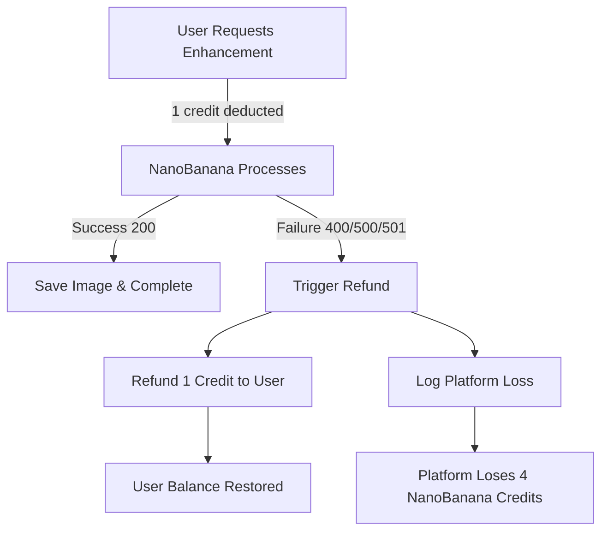

# 💳 Credit Refund System Documentation

## Overview
The platform automatically refunds users when image enhancements fail, ensuring fair credit usage and customer satisfaction.

## How Refunds Work

### User Perspective
- User spends **1 credit** for enhancement
- If enhancement fails → **1 credit refunded automatically**
- User sees refund in transaction history
- Balance restored immediately

### Platform Reality
- Platform spent **4 NanoBanana credits** (1:4 ratio)
- NanoBanana keeps those credits (no provider refund)
- Platform absorbs the loss (business cost)
- This is tracked for accounting

## Refund Triggers (Automatic)

### ✅ Full Refund (100% Credits Back)
Based on NanoBanana callback codes:

| Error Code | Error Type | Description | User Gets |
|------------|------------|-------------|-----------|
| 400 | `content_policy_violation` | Prompt violates content policy | 1 credit back |
| 500 | `internal_error` | NanoBanana server error | 1 credit back |
| 501 | `generation_failed` | Task failed to generate | 1 credit back |
| - | `storage_error` | We couldn't save the result | 1 credit back |
| - | `timeout` | Request timed out | 1 credit back |

### ❌ No Refund
| Error Type | Description | User Gets |
|------------|-------------|-----------|
| `user_cancelled` | User cancelled the task | No refund |
| `invalid_input` | User provided invalid data | No refund |

## The Callback Flow



## Implementation Details

### 1. NanoBanana Callback Handler
Located at: `/apps/edge/functions/nanobanana-callback/index.ts`

```typescript
// Callback receives:
{
  "code": 500,  // Error code
  "msg": "Internal error",
  "data": {
    "taskId": "abc123",
    "info": {
      "resultImageUrl": ""  // Empty on failure
    }
  }
}

// System automatically:
1. Updates task status to 'failed'
2. Processes refund to user
3. Logs platform loss
4. Creates audit trail
```

### 2. Database Tracking

#### Tables Involved:
- `enhancement_tasks` - Tracks task status and refund state
- `refund_policies` - Defines which errors trigger refunds
- `refund_audit_log` - Complete refund history
- `credit_transactions` - Shows refund as negative transaction

#### Refund Process:
```sql
-- Automatic refund function
process_credit_refund(
  task_id,      -- Failed task
  user_id,      -- User to refund
  credits: 1,   -- Always 1 from user perspective
  reason        -- Why it failed
)

-- This function:
1. Checks refund policy
2. Updates user balance (+1 credit)
3. Logs refund transaction
4. Records platform loss (4 NanoBanana credits)
```

### 3. Platform Loss Tracking

When a refund occurs:
```
User Impact:        -1 credit (spent) → +1 credit (refunded) = 0 loss
Platform Impact:    -4 NanoBanana credits (no refund from provider) = 4 credit loss
Business Cost:      €0.004 per failed enhancement (assuming €0.001/credit)
```

## Admin Dashboard Features

### Refund Monitoring
- View all refunds in admin dashboard
- Track refund rate by error type
- Monitor platform losses
- Identify patterns in failures

### Refund Metrics
```sql
-- Daily refund rate
SELECT 
  DATE(created_at) as date,
  COUNT(*) as refunds,
  SUM(credits_refunded) as total_credits,
  SUM(platform_loss) as nanobana_loss
FROM refund_audit_log
GROUP BY DATE(created_at);

-- Refund by error type
SELECT 
  refund_reason,
  COUNT(*) as count,
  SUM(credits_refunded) as credits
FROM refund_audit_log
GROUP BY refund_reason;
```

## User Experience

### What Users See:

1. **During Enhancement**:
   ```
   Balance: 10 credits
   Click "Enhance" → Balance: 9 credits
   Status: "Processing..."
   ```

2. **If Failed**:
   ```
   Status: "Enhancement failed"
   Notification: "Your credit has been refunded"
   Balance: 10 credits (restored)
   ```

3. **Transaction History**:
   ```
   -1 credit | Enhancement | 2:30 PM
   +1 credit | Refund (generation failed) | 2:31 PM
   ```

## Business Impact

### Cost Analysis
Per 1000 enhancements with 2% failure rate:
```
Successful: 980 × 4 = 3,920 NanoBanana credits used
Failed: 20 × 4 = 80 NanoBanana credits lost
User refunds: 20 credits
Platform loss: 80 NanoBanana credits (€0.08)
```

### Acceptable Loss Rates
- **< 1%**: Excellent, minimal impact
- **1-3%**: Normal, acceptable business cost
- **3-5%**: Concerning, investigate causes
- **> 5%**: Critical, urgent action needed

## Preventing Failures

### Common Failure Causes & Solutions:

1. **Content Policy Violations (400)**
   - Add content filtering before submission
   - Warn users about prohibited content
   - Pre-screen prompts

2. **Internal Errors (500)**
   - Monitor NanoBanana service health
   - Implement retry logic
   - Have backup providers ready

3. **Generation Failures (501)**
   - Validate input parameters
   - Check image URLs are accessible
   - Ensure prompts are reasonable length

## Testing Refunds

### Manual Test Process:
```bash
# 1. Create a test task that will fail
curl -X POST http://localhost:3000/api/enhance-image \
  -H "Authorization: Bearer $TOKEN" \
  -d '{
    "inputImageUrl": "invalid-url",
    "enhancementType": "upscale",
    "prompt": "test"
  }'

# 2. Simulate failure callback
curl -X POST http://localhost:3000/functions/v1/nanobanana-callback \
  -d '{
    "code": 500,
    "msg": "Internal error",
    "data": {
      "taskId": "YOUR_TASK_ID",
      "info": {"resultImageUrl": ""}
    }
  }'

# 3. Check user balance was refunded
```

## Configuration

### Refund Policies (Customizable)
```sql
-- View current policies
SELECT * FROM refund_policies;

-- Update policy
UPDATE refund_policies 
SET should_refund = true, 
    refund_percentage = 100
WHERE error_type = 'timeout';
```

### Environment Variables
```env
# Enable/disable auto refunds
AUTO_REFUND_ENABLED=true

# Refund processing delay (ms)
REFUND_DELAY_MS=1000

# Alert threshold (refund rate %)
REFUND_ALERT_THRESHOLD=5
```

## Monitoring & Alerts

### Key Metrics to Track:
- **Refund Rate**: Refunds / Total Enhancements
- **Platform Loss**: NanoBanana credits lost per day
- **Error Distribution**: Which errors occur most
- **User Impact**: Repeat failures for same user

### Alert Conditions:
- Refund rate > 5%
- Platform loss > 100 credits/hour
- Same user gets > 3 refunds/day
- Storage errors (indicates platform issue)

## FAQ

### Q: Does the platform get credits back from NanoBanana?
**A:** No. Once NanoBanana consumes credits, they're gone. The platform absorbs this loss.

### Q: Can users abuse the refund system?
**A:** Limited risk. Failures are triggered by NanoBanana, not users. We track patterns to detect abuse.

### Q: What if refund processing fails?
**A:** System logs critical alert. Admin must manually process. User support contacted.

### Q: How fast are refunds?
**A:** Immediate. As soon as failure callback received, credits restored.

### Q: Can admins override refund decisions?
**A:** Yes. Admins can manually process or reverse refunds via admin dashboard.

---

## Summary

The refund system ensures:
- ✅ **Fair user experience** - No charge for failed services
- ✅ **Automatic processing** - No manual intervention needed
- ✅ **Complete audit trail** - Every refund tracked
- ✅ **Business intelligence** - Platform loss monitoring
- ✅ **User trust** - Transparent and immediate refunds

**Platform absorbs ~€0.004 loss per failed enhancement as a cost of quality service.**