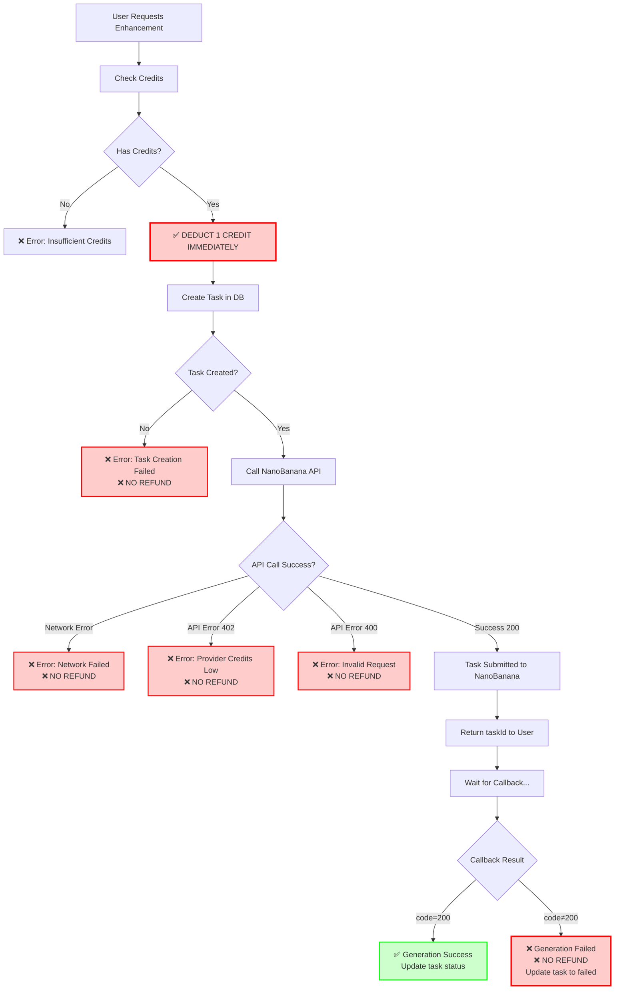
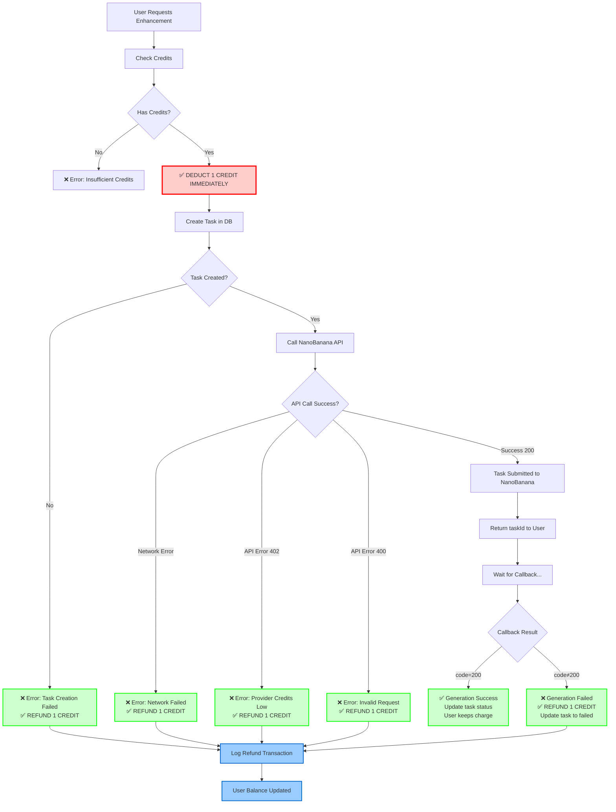

# Credit Flow & Refund Gap Visualization

## Current Flow (WITH PROBLEMS)



## What SHOULD Happen (WITH REFUNDS)



## Credit Transaction Lifecycle

### Scenario 1: Successful Enhancement
```
Time: 0s
├─ User Balance: 10 credits
├─ Action: Request enhancement
└─ Balance After Deduction: 9 credits

Time: 30s
├─ NanoBanana Processing...
└─ Status: pending → processing

Time: 60s
├─ NanoBanana Callback: SUCCESS
├─ Result: Enhanced image URL
└─ Final Balance: 9 credits ✅
```

### Scenario 2: Failed Enhancement (CURRENT BEHAVIOR - BAD)
```
Time: 0s
├─ User Balance: 10 credits
├─ Action: Request enhancement
└─ Balance After Deduction: 9 credits ❌ CHARGED

Time: 30s
├─ NanoBanana Processing...
└─ Status: pending → processing

Time: 60s
├─ NanoBanana Callback: FAILED (code 500)
├─ Result: Error message
├─ Refund: NONE ❌
└─ Final Balance: 9 credits ❌ USER LOSES CREDIT FOR NOTHING
```

### Scenario 3: Failed Enhancement (CORRECT BEHAVIOR - GOOD)
```
Time: 0s
├─ User Balance: 10 credits
├─ Action: Request enhancement
└─ Balance After Deduction: 9 credits

Time: 30s
├─ NanoBanana Processing...
└─ Status: pending → processing

Time: 60s
├─ NanoBanana Callback: FAILED (code 500)
├─ Result: Error message
├─ Refund: +1 credit ✅
└─ Final Balance: 10 credits ✅ USER GETS REFUND
```

### Scenario 4: Network Error Before API Call (CURRENT BEHAVIOR - BAD)
```
Time: 0s
├─ User Balance: 10 credits
├─ Action: Request enhancement
└─ Balance After Deduction: 9 credits ❌ CHARGED

Time: 0.5s
├─ Network Error: Cannot reach NanoBanana
├─ Return: Error response to user
├─ Refund: NONE ❌
└─ Final Balance: 9 credits ❌ USER LOSES CREDIT
```

### Scenario 5: Network Error Before API Call (CORRECT BEHAVIOR - GOOD)
```
Time: 0s
├─ User Balance: 10 credits
├─ Action: Request enhancement
└─ Balance After Deduction: 9 credits

Time: 0.5s
├─ Network Error: Cannot reach NanoBanana
├─ Refund: +1 credit ✅
├─ Return: Error response to user
└─ Final Balance: 10 credits ✅ USER GETS REFUND
```

## Platform Loss Breakdown

### Current State (No Refunds for Failures)

| Scenario | User Credit Lost | NB Credits Consumed | Platform USD Lost | User Experience |
|----------|------------------|---------------------|-------------------|----------------|
| Success | 1 ✅ | 4 | $0.10 | 😊 Good |
| Network Error | 1 ❌ | 0 | $0.00 | 😡 Lost credit for nothing |
| API Error | 1 ❌ | 0 | $0.00 | 😡 Lost credit for nothing |
| Callback Failure | 1 ❌ | 4 (maybe) | $0.10 (maybe) | 😡 Lost credit, unclear if NB charged |

**Analysis:**
- User loses credit even when service fails
- Platform may not lose money (NB wasn't charged)
- **Result: Bad UX, loss of user trust, possible refund disputes**

### Ideal State (With Refunds)

| Scenario | User Credit Lost | NB Credits Consumed | Platform USD Lost | User Experience |
|----------|------------------|---------------------|-------------------|----------------|
| Success | 1 ✅ | 4 | $0.10 | 😊 Good |
| Network Error | 0 ✅ (refunded) | 0 | $0.00 | 😊 Fair - didn't work, didn't pay |
| API Error | 0 ✅ (refunded) | 0 | $0.00 | 😊 Fair - didn't work, didn't pay |
| Callback Failure | 0 ✅ (refunded) | 4 (maybe) | $0.10 (maybe) | 😊 Fair - platform absorbs cost |

**Analysis:**
- User NEVER loses credit when service fails
- Platform may absorb cost if NB actually processed
- **Result: Excellent UX, user trust maintained, fair charging**

### Edge Case: NanoBanana Charged But Failed

When NanoBanana processes the image but returns failure:

**Without Refund:**
- User pays: 1 credit ($0.10 value)
- Platform pays: 4 NB credits ($0.10)
- Total platform loss: $0.10
- User experience: TERRIBLE (paid for failure)

**With Refund:**
- User pays: 0 credits (refunded)
- Platform pays: 4 NB credits ($0.10)
- Total platform loss: $0.10
- User experience: EXCELLENT (fair treatment)

**Recommendation:**
- Refund user in ALL failure cases
- Platform absorbs cost in edge cases
- Monitor failure rates to identify patterns
- Contact NanoBanana for credits if systematic failures

## Cost of Not Refunding

### User Impact
- Loss of trust in platform
- Potential churn/cancellations
- Negative reviews
- Support tickets demanding refunds
- Time spent handling disputes

### Platform Impact
- Reputation damage
- Manual refund processing time
- Potential payment disputes
- Regulatory/ToS compliance issues

### Actual Financial Impact

Assuming:
- 1000 enhancement attempts/month
- 5% failure rate = 50 failures/month
- 1 credit per enhancement = $0.10 value
- Without refunds: Users lose 50 × $0.10 = **$5/month in unfair charges**
- With automated refunds: $0 user loss, better UX

**ROI of implementing refunds:**
- Development time: ~4 hours
- Monthly user satisfaction gain: High
- Support time saved: ~2-3 hours/month
- User retention: Priceless

---

**Generated:** 2025-01-11
**Purpose:** Visualize credit flow and identify refund gaps

